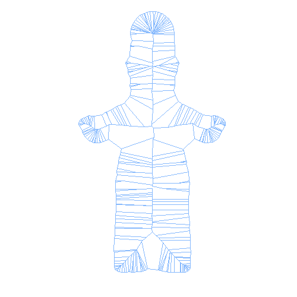
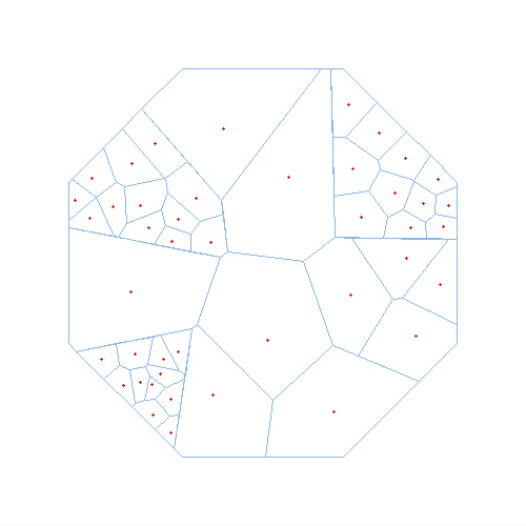

# Kiri2D

Kiri2D is a tool for developing 2D graphics applications, which has already implemented Convex hull, Delaunay diagram, Voronoi diagram, Power diagram, Lloyd iteration and Voronoi treemap for arbitrary geometry boundary based on QuickHull algorithm. Additionally, it also support Straight skeleton, Poisson disk sampling, ProtoSphere packing and Multi-sized particle sampling method. 

## Setup

### Command Line

```rb
cd /to/your/project/path
```

```rb
mkdir build
```

```rb
cd build
```

```rb
cmake .. -G "Visual Studio 17 2022" -A x64
```

### Scripts

#### For Windows

- cd to ./scripts folder
- choose your visual studio version(vs15/vs17/vs19/vs22)
- run the bat file

## Gallery
| Example | GIF |
| --- | --- |
| Convex Hull Example 1|  | 
| Convex Hull Example 2|  | 
| Delaunay Triangulation |  | 
| Straight Skeleton |  | 
| Voronoi Diagram Example 1 |  | 
| Voronoi Diagram Example 2 |  | 
| Lloyd Iteration Example 1 |  | 
| Lloyd Iteration Example 2 |  | 
| Voronoi TreeMap Example 1 |  | 
| Voronoi TreeMap Example 2 |  | 
| Poisson Disk Sampling |  | 

